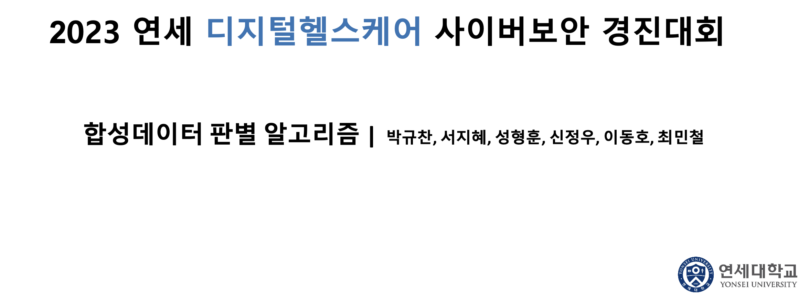

# 2023 연세 디지털헬스케어 사이버보안 경진대회 합성데이터 판별 알고리즘

## [작업기간]
2023.07 ~ 2023.08

## [프로젝트 배경]
- 신뢰 가능한 데이터의 확보를 위한 데이터 합성 유무 판별

## [프로젝트 목적]
1) 다양한 합성 방식으로 생성된 데이터에 대응할 수 있는 강건한 모델 구축
2) 폐 X-ray ray 사진을 포함하여 합성 데이터를 판별하는 일반화된 모형을 구축.
3) GradCAM GradCAM 을 통해 사진의 어느 부분이 중요한지 확인.
4) 데이터 도메인과 생성 모형의 차이를 파악하기 위해 VAE, DCGAN 등으로 직접 생성 후 판별. 5) 최종적으로는 incremental learning 또는대규모 사전 학습 후 전이 학습을 제시.
## [프로젝트 내용]
- 신뢰 가능한 데이터의 확보를 위한 데이터 합성 유무 판별

## 주요 업무 및 상세 역할
1) VisionTransformer사전학습모델사용및Fine-Tuning하여폐정상또는합성판별
2) 뇌MRI 사진을DeepConcvolutionGAN을사용하여합성이미지생성및ResNet,VGG,VIT등모델적용및판별